<h1 align="center">Hi, I'm Abhay Upadhyay</h1>
<h3 align="center">A software developer & ML Engineer from India.</h3>

  

## About Me

- Machine Learning and Data Science
- Java and Spring Boot
- Android development with Kotlin
- Data Structures & Algorithms
- Backend development and databases

## Connect with Me

  
  
  
  

## Tech Stack

### Languages

  
  
  
  
  

### AI / ML & Data Science

  
  
  
  
  
  

### Backend & Software Development

  
  
  
  

### Databases

  
  
  

### Mobile Development

  
  

### Web Development

  
  
  

## Projects

Private

## GitHub Stats

  

  

## Support

  

